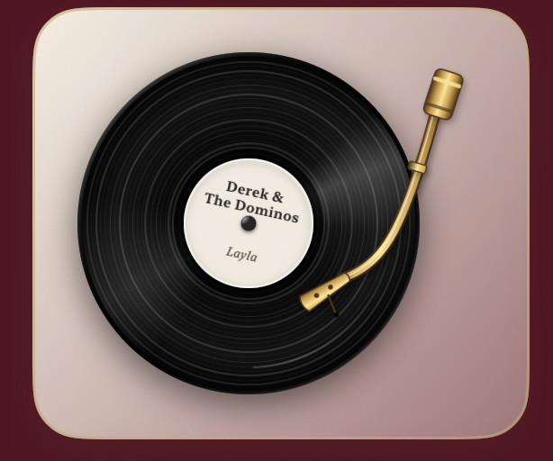

<p align="center">
  
</p>

<h1 align="center">Vinylette</h1>

<p align="center">
  A vintage vinyl record player widget for macOS, connected to the Spotify desktop app.
</p>

<p align="center">
  <a href="https://github.com/Sissighn/vinylette/actions/workflows/ci.yml"></a>
  
  
  
  
  <a href="LICENSE"></a>
</p>

<p align="center">
  <a href="https://github.com/Sissighn/vinylette/releases/latest"></a>
</p>

Vinylette lives on your desktop like a native widget: above the wallpaper and
icons, beneath every application window. While music plays, the record spins,
the gold tonearm rests on the vinyl, and the current track is printed on the
record label.

## Designs

Three looks, selectable from the settings menu that appears when hovering over
the widget. The choice is remembered across launches.

| Classic Label | Album Cover | Sleeve |
| :---: | :---: | :---: |
|  |  |  |
| Artist and track printed on the record label | The album artwork as the record label | The record peeking out of its album sleeve |

## Features

- Spinning record with a stationary light reflection; only the label rotates,
  as it would on a real turntable
- Clickable gold tonearm with a Play/Pause tooltip and design-specific hover
  controls for previous, play/pause, next, and repeat
- Three selectable designs, persisted across launches
- Desktop-widget window behavior: always on the desktop, never above your apps,
  present on every Space
- Remembers its dragged position and moves back onscreen when the display setup
  changes
- Pauses its animation while fully covered by other windows, so it consumes
  no energy it cannot show
- Custom monochrome vinyl menu bar item with the current track, complete
  playback controls, dynamic show/hide action, design picker,
  launch-at-login toggle, and quit action
- Localized interface and accessibility labels in English and German
- No login and no API keys; playback state arrives instantly via Spotify's
  distributed notifications, commands go through AppleScript

## Requirements

- macOS 13 or later
- Xcode (Command Line Tools alone are not sufficient for SwiftUI apps)
- Spotify desktop app

## Build and Run

`build.sh` cross-compiles the app for Apple Silicon and Intel, combines both
executables into a Universal 2 binary, enables the Hardened Runtime, embeds the
Apple Events entitlement required for Spotify, and verifies the resulting app
bundle.

```sh
./build.sh
open Vinylette.app
```

By default the local build is signed ad hoc. This is free and suitable for
development, but a Mac that downloads the app will still require the user to
approve its first launch through Finder's **Open** command. Removing that
Gatekeeper step requires a paid Developer ID certificate and notarization.

## Release Artifacts

Create the same distributable files that CI validates:

```sh
./release.sh
```

The `dist/` directory contains:

- a Universal 2 app ZIP
- a compressed DMG with an Applications shortcut
- a zipped universal dSYM for crash symbolication
- `SHA256SUMS` covering every artifact

Pushing a version tag matching `CFBundleShortVersionString` publishes these
files as a GitHub Release automatically:

```sh
git tag v1.0.0
git push origin v1.0.0
```

Release history is documented in the [changelog](CHANGELOG.md).

The scripts are ready for a future Developer ID certificate without changing
the build pipeline:

```sh
VINYLETTE_SIGNING_IDENTITY="Developer ID Application: Your Name (TEAMID)" ./release.sh
```

On first launch, macOS asks whether Vinylette may control Spotify. Confirm with
"Allow". If you decline by accident, re-enable it under System Settings >
Privacy & Security > Automation.

## Architecture

The app is a SwiftUI view hosted in a borderless, non-activating `NSPanel`
pinned one window level below normal application windows.

Playback state is event-driven rather than polled: the controller subscribes
to Spotify's `com.spotify.client.PlaybackStateChanged` distributed
notification, so track changes reach the UI instantly and the app does no
periodic work. Notifications cross an explicit Main Actor boundary and reduce
into one playback state; stale artwork requests are cancelled and ignored.
AppleScript is only used in three places — reading the initial
state at launch, looking up cover art URLs, and sending playback commands.
Script failures are logged via `os.Logger` and surfaced in the UI: when the
Automation permission is missing, the widget shows a hint with a direct
shortcut to the relevant System Settings pane. This design avoids OAuth, API
keys, and any network dependency beyond fetching cover art.

The spin animation runs in a frame loop that pauses automatically while the
panel is fully covered by other windows, tracked through the window's
occlusion state.

```
Sources/Vinylette
├── App
│   ├── VinyletteApp.swift      Entry point
│   ├── AppDelegate.swift       Wires panel, menu bar, and Spotify controller
│   ├── FloatingPanel.swift     Desktop-level, borderless, draggable panel
│   ├── Localization.swift      String Catalog access for AppKit and SwiftUI
│   ├── MenuBarVinylIcon.swift  Native monochrome template icon
│   ├── PanelVisibility.swift   Occlusion state observed by the UI
│   └── StatusBarController.swift
├── Spotify
│   ├── SpotifyController.swift Playback state and commands (event-driven)
│   ├── PlaybackState.swift     Single playback state and recoverable errors
│   ├── SpotifyTrack.swift      Track metadata and boundary payload parsing
│   └── AppleScriptRunner.swift
└── UI
    ├── VinylView.swift         Main view and the three design layouts
    ├── VinylDisc.swift         Record, grooves, label
    ├── Tonearm.swift
    ├── PlaybackControls.swift
    ├── WidgetDesign.swift
    ├── WidgetLayout.swift      Shared dimensions and motion constants
    └── Palette.swift
```

## Engineering Decisions

### AppleScript instead of the Spotify Web API

Vinylette is a local companion for the Spotify desktop app, not a standalone
Spotify client. AppleScript keeps that scope honest: it needs no OAuth flow,
client secret, account login, token storage, callback server, or playback
device management. It is used only for the initial state, cover-art URL lookup,
and playback commands.

### A desktop-level `NSPanel`

The product is meant to feel like an object sitting on the desktop. A
borderless, non-activating panel can stay above the wallpaper and desktop icons
while remaining below ordinary application windows, appear on every Space,
and avoid taking focus or adding a Dock icon.

### Event-driven playback updates

Spotify's distributed playback notification updates the UI immediately when a
track or playback state changes. This avoids periodic polling, reduces idle
work, and keeps the record and tonearm synchronized with the player.

## Limitations

- Vinylette supports the Spotify desktop app only; it does not follow Spotify
  Web Player, mobile devices, Apple Music, or other players.
- The integration relies on Spotify's AppleScript dictionary and distributed
  notification payload. Spotify could change these undocumented interfaces in
  a future desktop release.
- Album artwork needs a network connection because it is downloaded from the
  cover URL supplied by Spotify.
- The free release is signed ad hoc. On another Mac, the first launch must be
  approved with Finder's **Open** command; seamless Gatekeeper distribution
  requires a paid Developer ID certificate and notarization.
- The current widget has a fixed visual size and requires macOS 13 or later.

## Privacy

Vinylette has no analytics, telemetry, advertising, account system, or backend,
and it never records, streams, or uploads audio. It reads playback metadata
from the local Spotify app and downloads the current cover from the URL Spotify
provides. Design choice, window position, and launch-at-login preference stay
on the Mac in the standard system stores.

The artwork in the README screenshots is a fictional cover created specifically
for this repository, not third-party album artwork. Its provenance and prompt
are documented in [`docs/assets`](docs/assets/README.md).

## Testing

```sh
swift test
```

Unit tests cover the Spotify state machine end to end through injected
dependencies: parsing of AppleScript responses and notification payloads,
command dispatch with optimistic updates and rollback, launch and termination
transitions, and out-of-order artwork downloads that must never overwrite a
newer track. Pure logic that used to hide in the UI layer is extracted and
tested directly: the multi-screen clamping geometry of the floating panel,
design persistence through a central settings type, and the launch-at-login
menu behavior behind a `LoginItemManaging` protocol. A localization suite
keeps the string catalog, both compiled `.lproj` tables, and every key
referenced from code in sync.

Localized strings live once, in `Localizable.xcstrings`; the `.lproj` tables
are generated from it via `scripts/generate-strings.sh` and never edited by
hand. Typed accessors (`L10n.Menu.quit` instead of raw key strings) keep the
call sites safe from typos.

CI lints with `swift-format`, treats warnings as errors, builds both processor
architectures, fails when the generated string tables drift from the catalog,
validates property-list resources, verifies the Hardened Runtime signature and
entitlement, exercises ZIP/DMG integrity, and uploads the release artifacts on
every push.

## License

Released under the [MIT License](LICENSE).
